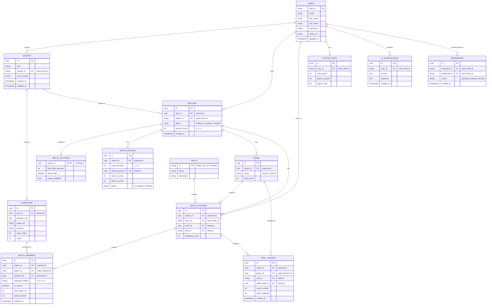

# Entity Relationship Diagram (ERD)

This is the extended Entity Relationship Diagram for the Zinko Quiz application, including future features like multiplayer matches, teams, player skills, leaderboards, game state logs, and AI assistant tracking.

