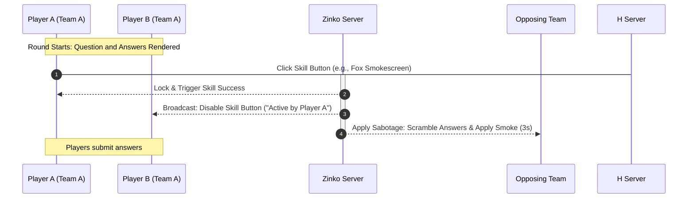

# ⚔️ Zinko: Core System & Feature Documentation

> A real-time multiplayer educational battle game where speed, strategy, and teamwork determine victory.

Zinko reimagines traditional quiz games by overlaying them with competitive, MOBA-style draft mechanics, real-time strategy skills, and cooperative gameplay. Designed for classroom environments (like high school students) and trivia enthusiasts, Zinko eliminates the stress of individual pressure by focusing on collective team performance and strategic cooperation.

---

## 🎯 Game Overview & The Core Hook

In Zinko, two teams (Team A and Team B) face off across multiple rounds. Unlike standard quiz games where players only compete for individual speed and accuracy, Zinko players must coordinate their **Character Skills** and leverage a real-time **Lockout System** to outmaneuver their opponents.

```
       ┌──────────────────────────────────────────────────────────┐
       │                     Draft Phase                          │
       │  (Select unique team skills: Rabbit, Fox, Butterfly, etc)│
       └────────────────────────────┬─────────────────────────────┘
                                    │
                                    ▼
       ┌──────────────────────────────────────────────────────────┐
       │                     Start Round                          │
       │             (Question displays to all)                    │
       └────────────────────────────┬─────────────────────────────┘
                                    │
                                    ▼
       ┌──────────────────────────────────────────────────────────┐
       │                Real-Time Strategy Phase                  │
       │    (Activate Team Skill before answering under lockout)   │
       └────────────────────────────┬─────────────────────────────┘
                                    │
                                    ▼
       ┌──────────────────────────────────────────────────────────┐
       │                     Fastest Finger                       │
       │           (Compute fastest correct answer)               │
       └────────────────────────────┬─────────────────────────────┘
                                    │
                                    ▼
       ┌──────────────────────────────────────────────────────────┐
       │                     Apply Modifiers                      │
       │    (Double points, point-steals, smokescreens, etc)     │
       └────────────────────────────┬─────────────────────────────┘
                                    │
                                    ▼
       ┌──────────────────────────────────────────────────────────┐
       │                    Update Leaderboard                    │
       │              (Transition to next round)                  │
       └─────────────────────────────────────────────────────────┘
```

---

## 👥 Feature 1: Team-Based Multiplayer & The Draft Phase

Before any match begins, players join a lobby and are divided into two opposing teams. To promote strategic diversity, teams must participate in a **Draft Phase** where roles and skills are assigned.

* **Unique Role Selection:** Every member of the team must choose **exactly one** unique skill. 
* **Anti-Duplicate Lock:** No two players on the same team can equip the same skill. This guarantees that each team will have a diverse toolkit (e.g., one speed specialist, one supporter, one saboteur, and one thief).
* **Communication Catalyst:** The draft phase encourages instant peer-to-peer discussion, forcing players who might normally be isolated to coordinate their team comp before the game starts.

---

## 🎭 Feature 2: Strategic Skills & Charge Limits

Skills are not infinite; they are high-impact abilities governed by a **Charge System** (limited charges per match). This prevents spamming and forces teams to save their most powerful skills for high-value rounds.

There are two primary thematic skill profiles supported by the Zinko engine:

### 🐾 Profile A: Animal Class Strategy (Active Mechanics)

| Skill Icon & Name | Strategic Role | Max Charges | Active Mechanism | Tactical Value |
| :--- | :--- | :--- | :--- | :--- |
| **🐇 The Rabbit** *(Adrenaline Rush)* | Point Multiplier | **2 per match** | Triggers a 5-second countdown. If the team answers correctly in under 5 seconds, they receive **x2 points** for the round. | **High Swing:** Used on easy or confident questions for massive score gains. |
| **🦊 The Fox** *(Smokescreen)* | Saboteur (Offensive) | **3 per match** | Instantly scrambles the opposing team's multiple-choice answers or covers their text in "smoke" for 3 seconds. | **Disruption:** Activated immediately at the start of a round to delay the opponent's fast answers. |
| **🦋 The Butterfly** *(The Oracle)* | Team Support | **2 per match** | Instantly removes **2 incorrect answers** (50/50) from the screens of the entire team. | **Safety Net:** Activated on extremely difficult questions to secure the team's points. |
| **🐸 The Frog** *(Sticky Tongue)* | The Thief | **3 per match** | If the Frog answers correctly, they **steal 50% of the points** earned by the fastest correct player on the opposing team. | **Counter-Play:** Shuts down the opponent's "star player" who consistently gets the fastest finger. |

### 🛡️ Profile B: Tactical Class Strategy (Passive/Stat Modifiers)

* **🛡️ Guardian:** Protects the entire team from incoming enemy sabotage effects (like the Fox's Smokescreen).
* **⚔️ Sapper:** Subtracts a fixed amount or percentage from the enemy team's score.
* **📈 Catalyst:** Boosts the team's score for the round by a flat **+20%** modifier.
* **💰 Trickster:** Steals points from the enemy team's reserve and adds them to your own.

---

## 🔒 Feature 3: Real-Time WebSocket "Lockout" System

To prevent chaos and avoid teammates wasting multiple skills on the same question, Zinko uses a **"First Come, First Served" Lockout system** powered by real-time WebSockets (Socket.IO).

### How it works:
1. When a new question loads, the **Skill Button** lights up on all active players' screens.
2. A player must tap their skill button **before** submitting their answer.
3. The instant a player clicks the skill button, a WebSocket event is fired to the backend.
4. The server registers the activation and instantly broadcasts a lock command to all other players on that team.
5. Within milliseconds, the skill buttons for all other teammates turn grey (disabled) and display: `"Skill active by [Teammate Name]"`.

### Lockout Sequence Flow:



---

## ⚡ Feature 4: Fastest Finger & Round Evaluation

Zinko rewards both **accuracy** and **speed**. The core game loop evaluates answers dynamically:

* **Simultaneous Answering:** All players on both teams answer questions at the same time.
* **Fastest Correct Player:** The server tracks response times down to the millisecond. The player who submits the correct answer the fastest earns additional weight for their team's scoring and triggers their team's active skill effects.
* **No Negative Penalty:** Incorrect answers yield **0 points**, removing individual performance anxiety and keeping the game's atmosphere supportive and fun.

---

## 🔥 Feature 5: 2X Point Rounds (High Stakes)

The host can mark specific rounds as **2X Point Rounds** (e.g., final rounds or tie-breakers). 
* All base points earned in these rounds are doubled: `FinalScore = BaseScore * 2`.
* Active skills (such as the Rabbit's multiplier) stack with the 2X modifier, allowing for dramatic, last-second comebacks.

---

## 🖥️ Feature 6: Host Dashboard, CRUD Quizzes, & AI Generator

For teachers and hosts, Zinko provides an intuitive workspace to manage and launch game sessions quickly.

* **Classroom Setup:** Hosts can launch a game lobby and display a large QR code or Game PIN. Players join instantly on mobile or desktop without needing a complex signup process.
* **CRUD Quiz Builder:** Easily create, update, and organize custom quizzes categorized by subjects.
* **AI Quiz Generation:** Integrated AI features allow hosts to paste text or specify a topic, generating a complete, formatted quiz with multiple-choice options in seconds.

---

## 📊 Feature 7: Progression, Leaderboards, & Socials

Zinko keeps players engaged even after the match ends through profile metrics and friends lists.

* **Match Summaries & MVP:** Detailed round breakdowns showing who activated which skill, who was the fastest, and who earned the MVP title.
* **Player Stats:** Profiles tracking total points earned, games played, and win ratios.
* **Social Connections:** A friendship management system allowing players to search, send, accept, or block friend requests to build a community.
