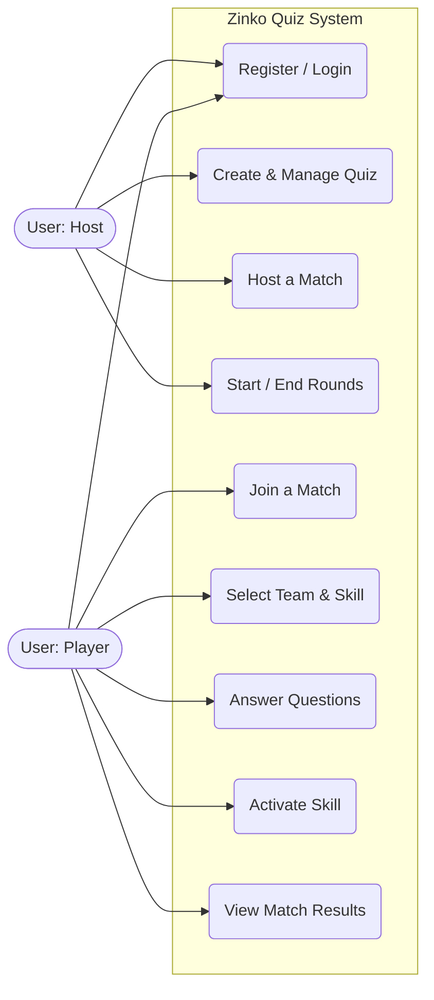
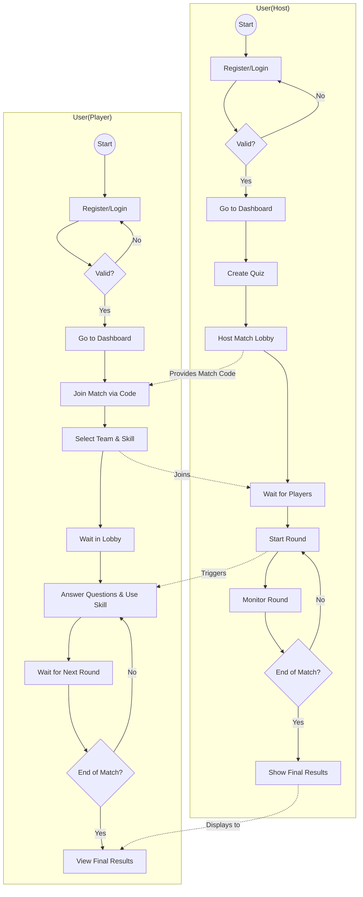

# Zinko Quiz - System Diagrams

Based on your request, I've created the diagrams in Mermaid notation so they render directly in Markdown. 

Since your attached image is a **Swimlane Activity Diagram** (showing the step-by-step flow), I have completed that flow for both the Host and Player. I have also included a standard **Use Case Diagram** to show the distinct actions each actor can perform in the system.

## 1. Use Case Diagram

This diagram shows what each actor (Host vs Player) can do within the Zinko system.

## 2. Swimlane Activity Diagram (Based on your image)

This flowchart expands on the diagram you started in the image, showing the sequential flow and interactions between the Host and the Player during a game.

